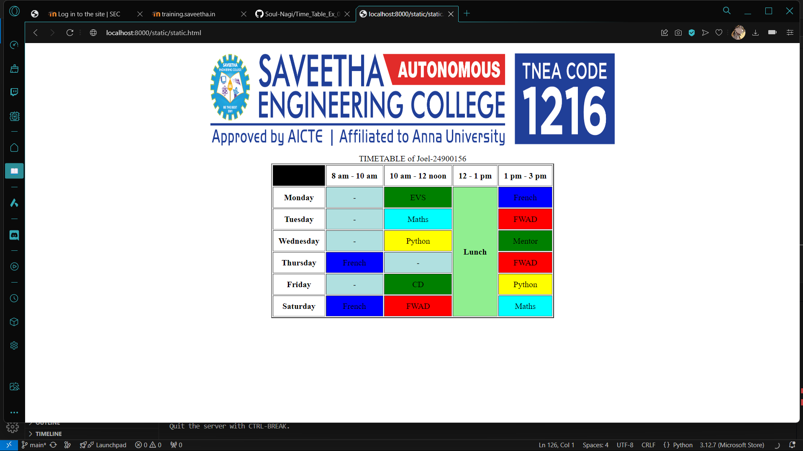

# Ex03 Time Table
## Date:
16/11/2024
## AIM
To write a html webpage page to display your slot timetable.

## ALGORITHM
### STEP 1
Create a Django-admin Interface.

### STEP 2
Create a static folder and inert HTML code.

### STEP 3
Create a simple table using ```<table>``` tag in html.

### STEP 4
Add header row using ```<th>``` tag.

### STEP 5
Add your timetable using ```<td>``` tag.

### STEP 6
Execute the program using runserver command.

## PROGRAM
```
<!DOCTYPE html>
<html>
    <header><center></center></header>
    <body>
        <table align="center" border="2" cellpadding="10">
            <caption>TIMETABLE of Joel-24900156</caption>
            <tr>
                <th bgcolor="Black"></th><th>8 am - 10 am</th><th>10 am - 12 noon</th><th>12 - 1 pm</th><th>1 pm - 3 pm</th>
            </tr>
            <tr>
                <th>Monday</th>
                <td align="center" bgcolor="biege">-</td>
                <td align="center" bgcolor="green">EVS</td>
                <th rowspan="6"bgcolor="lightgreen">Lunch</th>
                <td align="center" bgcolor="blue">French</td>
            </tr>
            <tr>
                <th>Tuesday</th>
                <td align="center" bgcolor="biege">-</td>
                <td align="center" bgcolor="cyan">Maths</td>
                <td align="center" bgcolor="red">FWAD</td>
            </tr>
            <tr>
                <th>Wednesday</th>
                <td align="center" bgcolor="biege">-</td>
                <td align="center" bgcolor="yellow">Python</td>
                <td align="center" bgcolor="green">Mentor</td>
            </tr>
            <tr>
                <th>Thursday</th>
                <td align="center" bgcolor="blue">French</td>
                <td align="center" bgcolor="biege">-</td>
                <td align="center" bgcolor="red">FWAD</td>
            </tr>
            <tr>
                <th>Friday</th>
                <td align="center" bgcolor="biege">-</td>
                <td align="center" bgcolor="green">CD</td>
                <td align="center" bgcolor="yellow">Python</td>
            </tr>
            <tr>
                <th>Saturday</th>
                <td align="center" bgcolor="blue">French</td>
                <td align="center" bgcolor="red">FWAD</td>
                <td align="center" bgcolor="cyan">Maths</td>
            </tr>
        </table>
        
    </body>
</html>

```

## OUTPUT


## RESULT
The program for creating slot timetable using basic HTML tags is executed successfully.
